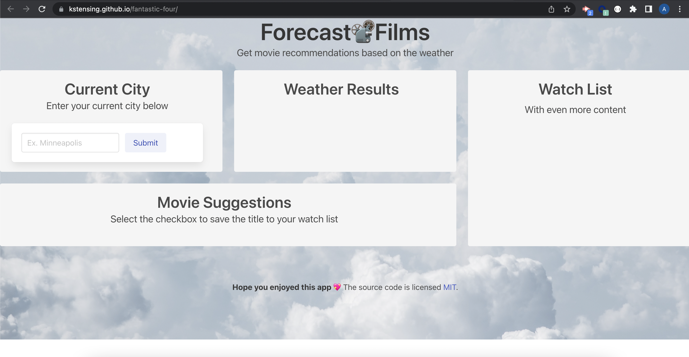

# Forecast📽️Films

## Have you ever wondered what to watch? Why not let the weather help you out?!
### This Group Project:
1. Uses a CSS framework other than Bootstrap.
2. Is deployed to GitHub Pages.
3. Is interactive (accepts city input and save movie option)
4. Uses two server-side APIs.
5. Does not use alerts, confirms, or prompts (use modals).
6. Uses client-side storage to store persistent data (save movie option)
7. Is responsive.
8. Has a polished UI.
9. Has a clean repository that meets quality coding standards
10. Has a quality README (with unique name, description, technologies used, screenshot, and link to deployed application).
11. Is added to our project portfolio's created in Module 2.

## Made With
  

<!-- comment -->

## See our Demo and what to expect:

Click this [LINK](https://kstensing.github.io/fantastic-four/) for the landing page.

The application should resemble the image below:

## Credits

Photo by <a href="https://unsplash.com/@elcarito?utm_source=unsplash&utm_medium=referral&utm_content=creditCopyText">elCarito</a> on <a href="https://unsplash.com/s/photos/cloud?utm_source=unsplash&utm_medium=referral&utm_content=creditCopyText">Unsplash</a>
    
## Contributors:
Kate Stensing, Caleb Luster, Stephanie Anderson, and Allyssa Angell

## License

<!--

-->